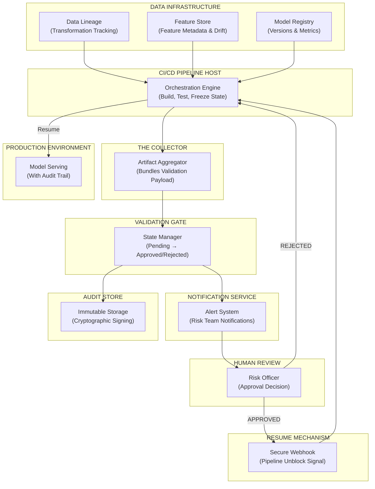
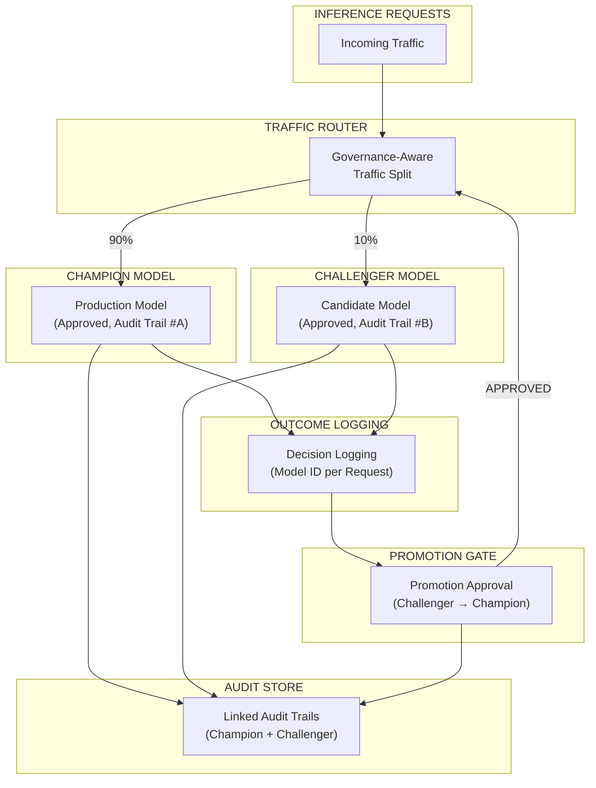
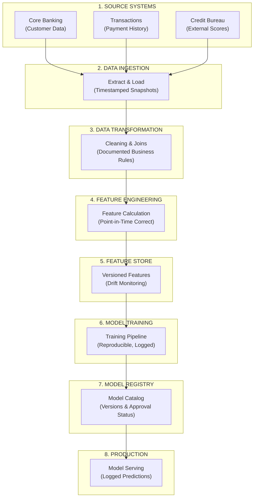

# ML Governance for Financial Services
## A Guide to Compliance-Ready Machine Learning Architecture

**j8q labs** | Hybrid AI Infrastructure for Regulated Enterprises

---

## 1. Executive Summary

Financial services organizations are investing heavily in machine learning to drive credit decisions, detect fraud, price risk, and automate underwriting. Yet a critical gap exists between how quickly ML teams can build models and how long those models wait for regulatory approval.

**The core challenge**: Model Risk Management (MRM) requirements demand rigorous documentation, validation, and audit trails before any model reaches production. Traditional software deployment practices—designed for "ship fast, fix later"—fundamentally conflict with regulatory expectations of "prove correctness before shipping."

The result? Models sit in validation queues for months. Engineering teams grow frustrated. ML investments deliver no business value while waiting for approval. And when models finally do deploy, audit trails are incomplete, creating regulatory exposure.

**This whitepaper introduces Compliance Orchestration**—a middleware architecture that bridges the gap between high-velocity engineering and slow-moving governance. By automating the collection of audit artifacts and enforcing governance gates within CI/CD pipelines, organizations can:

- Reduce validation cycle times from months to weeks
- Eliminate back-and-forth between ML teams and validators
- Ensure complete audit trails for every model deployment
- Free engineers to focus on model quality instead of compliance paperwork

The architecture presented here is technology-agnostic and applicable to cloud, on-premise, or hybrid deployments.

---

## 2. The Problem: ML in Regulated Industries

### 2.1 The Validation Bottleneck

In regulated financial services, no model reaches production without validation approval. This is not optional—Federal Reserve guidance (SR 11-7) and internal Model Risk Management (MRM) policies require independent validation of all models used in material business decisions.

The validation process exists for good reasons: it protects institutions from deploying flawed models that could lead to discriminatory lending, inaccurate risk assessments, or regulatory violations. However, the implementation of this process has become a critical bottleneck.

**Consider a typical scenario:**

1. An ML team spends 4 weeks developing a credit scoring model
2. They submit the model for validation
3. The validation team, overwhelmed with requests, takes 3 weeks to begin review
4. Validators request additional documentation about data sources
5. Back to the ML team—another week to compile the information
6. Validators request model performance metrics on specific segments
7. Back to the ML team—another week
8. This cycle repeats 3-5 times
9. Total time: 4-6 months from development completion to production

**The math is painful**: It doesn't matter if your ML team can build a model in 4 weeks if validation takes 4 months. The bottleneck is not model development—it's everything that happens after.

### 2.2 The Broken Handoff Problem

The root cause of validation delays is rarely the validators themselves. It's the handoff process between ML teams and validation teams.

**ML teams don't know what validators need.** There's no standardized "validation packet." Every submission is ad-hoc, based on tribal knowledge of what worked last time. Engineers spend mental energy guessing what documentation to create, often missing critical artifacts.

**Validators receive incomplete submissions.** They must request missing information, wait for responses, and repeat. A single missing data lineage diagram can add weeks to the process.

**Developer cognitive load compounds.** Engineers who should be improving model performance instead spend their mental energy on compliance paperwork. They context-switch between technical work and administrative tasks, reducing productivity on both fronts.

**The organizational cost is significant:**
- Senior ML engineers spending 20-30% of their time on compliance documentation
- Validation teams stuck in "request-wait-review-request" loops
- Leadership frustrated by slow time-to-value on ML investments
- Increased risk of incomplete audit trails when shortcuts are taken under pressure

### 2.3 What Regulators Actually Expect

Understanding regulatory expectations is essential for designing an effective governance architecture. The Federal Reserve's SR 11-7 guidance establishes three pillars of Model Risk Management:

**Model Development**
- Documented methodology and assumptions
- Data quality assessment and source verification
- Feature engineering rationale
- Training procedures and hyperparameter selection

**Model Validation**
- Independent review by qualified validators
- Conceptual soundness assessment
- Outcome analysis and backtesting
- Sensitivity and stability analysis

**Model Use**
- Defined scope and limitations
- Ongoing performance monitoring
- Clear escalation procedures
- Regular recalibration criteria

For each model, regulators expect to see a complete evidence chain: Where did the data come from? How was it transformed? What decisions were made during development? Who approved the model, and on what basis?

**The cost of non-compliance is substantial.** Enforcement actions against financial institutions for MRM failures have resulted in consent orders, operational restrictions, and fines in the hundreds of millions. Beyond financial penalties, failed audits damage institutional reputation and executive credibility.

### 2.4 Why Traditional CI/CD Fails

Modern software engineering has embraced Continuous Integration and Continuous Deployment (CI/CD): automated pipelines that build, test, and deploy code multiple times per day. This approach works brilliantly for web applications where rapid iteration is valued and mistakes can be quickly corrected.

**Regulated ML operates under fundamentally different constraints.**

| Traditional CI/CD | Regulated ML Requirements |
|------------------|--------------------------|
| Ship fast, fix later | Prove correctness before shipping |
| Automated deployments | Human approval required |
| Code is the artifact | Model + data + code are the artifact |
| Rollback is trivial | Model rollback has compliance implications |
| Developers own deployment | Separation of duties required |

Standard CI/CD pipelines have no concept of governance gates. They cannot freeze deployment awaiting human approval. They don't automatically collect the audit artifacts validators need. They assume the goal is deployment velocity—when the actual goal in regulated ML is *compliant* deployment velocity.

**The result**: Organizations either bolt on governance as an afterthought (creating the bottleneck described above) or abandon CI/CD entirely for ML (losing the automation benefits that engineering teams depend on).

There is a better way.

---

## 3. The Solution: Compliance Orchestration

Compliance Orchestration is a middleware architecture that sits between ML engineering workflows and governance processes. It enforces a "Validation Handshake" pattern: pipelines freeze until governance approves, and every deployment carries a cryptographically linked audit trail.

### 3.1 Eliminating the Back-and-Forth

The single most impactful change is automating the creation of a **Standardized Validation Packet**.

Instead of ML teams guessing what validators need, the system automatically collects:
- Data lineage (every transformation from source to feature)
- Feature metadata and drift metrics
- Model version, hyperparameters, and training configuration
- Performance metrics across required segments
- Code commit references and change history
- Environment specifications for reproducibility

**ML teams never wonder "what do I need to provide?"** The system knows. It extracts this information from the tools engineers already use: data pipelines, feature stores, model registries, and version control systems.

**Validators receive complete submissions on first attempt.** No missing artifacts. No back-and-forth requests. The validation packet contains everything needed to perform the review.

**Result**: Weeks of communication overhead reduced to a single, complete handoff.

### 3.2 Reducing Developer Cognitive Load

The traditional approach treats compliance as something engineers must actively do—a manual task that competes with technical work for their attention.

Compliance Orchestration inverts this relationship. **Audit artifacts are generated automatically as a byproduct of development.** Engineers use their normal tools—notebooks, pipelines, feature stores—and the governance system captures lineage and metadata without additional effort.

**Key principle: "Compliance by default" not "compliance as an afterthought."**

This means:
- No manual documentation of data sources (captured from pipeline execution)
- No manual tracking of model versions (captured from model registry)
- No manual compilation of metrics (captured from experiment tracking)
- No manual creation of audit reports (generated from captured artifacts)

Engineers focus on model quality. Compliance emerges from the system architecture.

### 3.3 Accelerating the Validation Queue

With standardized, complete validation packets, the validation team can work more efficiently:

**Faster initial review**: Validators don't waste time requesting missing information. They can begin substantive review immediately upon receiving a submission.

**Clearer decision criteria**: The governance system defines what "approval" means. Validators have documented criteria, not subjective judgment calls that vary between reviewers.

**Parallel reviews enabled**: When submissions are self-contained, multiple validators can review different aspects simultaneously. The serial bottleneck of back-and-forth communication is eliminated.

**Documented rejection rationale**: When models are rejected, the system captures specific reasons. ML teams know exactly what to fix for resubmission.

**Result**: Approval cycles measured in weeks instead of months.

### 3.4 The "Validation Handshake" Pattern

At the heart of Compliance Orchestration is a pattern we call the **Validation Handshake**:

1. **Pipeline Freeze**: When a model is ready for deployment, the CI/CD pipeline pauses. It does not continue to production.

2. **Artifact Collection**: The system automatically collects all required audit artifacts and bundles them into a signed Validation Payload.

3. **Gate Submission**: The Validation Payload is submitted to a governance gate. This creates a pending approval request visible to the validation team.

4. **Human Review**: Validators examine the payload. They approve, reject, or request clarification.

5. **Cryptographic Linking**: Upon approval, the system cryptographically links the approval decision to the specific model version, data snapshot, and code commit. This link cannot be forged or modified.

6. **Pipeline Resume**: A secure webhook signals the pipeline to continue. The model deploys to production with a complete audit trail.

**Core principle: No model reaches production without a complete, cryptographically linked audit trail.**

This isn't a bureaucratic hurdle—it's a technical architecture that makes compliance automatic, auditable, and efficient.

---

## 4. Reference Architecture

The following architecture diagram illustrates the complete Compliance Orchestration system. Each component has a specific role in ensuring that models reach production with complete audit trails while minimizing friction for engineering teams.

### 4.1 Architecture Overview

### 4.2 Component Descriptions

Each component in the architecture addresses a specific problem in the model governance workflow:

| Component | Role | What It Does | Problem It Solves |
|-----------|------|--------------|-------------------|
| **Data Lineage** | The Historian | Tracks every data transformation from source to feature | "Where did this data come from?" — answered automatically |
| **Feature Store** | The Librarian | Serves features, monitors drift, stores metadata | "What features were used?" — no manual documentation |
| **Model Registry** | The Catalog | Central model inventory with versions, metrics, approval tags | "Which model version?" — single source of truth |
| **Pipeline Host** | The Orchestrator | Runs builds, manages freeze/resume states | Enforces governance — no bypassing approval |
| **The Collector** | The Auditor | Bundles all artifacts into signed validation payload | **Eliminates back-and-forth** — complete packet every time |
| **Validation Gate** | The Gatekeeper | Manages approval lifecycle, stores pending requests | Clear workflow — validation knows exactly what to do |
| **Notification Service** | The Messenger | Alerts risk team, creates compliance tickets | No requests lost in email — tracked and visible |
| **Audit Store** | The Vault | Immutable storage with cryptographic linking | "Prove it" — evidence chain for regulators |
| **Resume Mechanism** | The Key | Secure handshake that unblocks pipeline | Instant deployment once approved — no manual steps |

### 4.3 Data Flow Walkthrough

**Step 1: Data Infrastructure Integration**

The Data Lineage component tracks every transformation applied to raw data. When data flows through ETL pipelines, lineage metadata is captured: source tables, transformation logic, join keys, and aggregation rules.

The Feature Store serves as a central repository for ML features. Beyond serving features for inference, it tracks which features were used for training, monitors for drift, and maintains point-in-time correctness for reproducibility.

The Model Registry maintains a catalog of all model versions. Each entry includes training metrics, hyperparameters, the dataset used, and approval status.

**Step 2: Pipeline Execution and Freeze**

When a model is ready for deployment, the CI/CD Pipeline Host executes build and test stages normally. At the governance checkpoint, the pipeline enters a **freeze state**—it pauses execution and does not proceed to production.

This freeze is enforced by the architecture, not by policy alone. Engineers cannot manually bypass the gate because the deployment credentials are held by the Resume Mechanism, not the pipeline itself.

**Step 3: Artifact Collection**

The Collector queries each data infrastructure component:
- From Data Lineage: transformation history, source-to-feature mapping
- From Feature Store: feature metadata, drift metrics, feature versions
- From Model Registry: model version, training configuration, performance metrics

These artifacts are bundled into a **Validation Payload**—a single, self-contained package containing everything validators need to assess the model.

**Step 4: Governance Gate Submission**

The Validation Payload is submitted to the Validation Gate. The gate:
- Assigns a unique request ID
- Sets initial status to "Pending"
- Stores the payload for review
- Triggers notifications to the validation team

**Step 5: Human Review**

Risk officers receive notification that a model awaits review. They access the Validation Gate interface to examine the payload.

The review interface presents:
- Model performance metrics across required segments
- Data lineage visualization
- Feature importance and drift analysis
- Code changes since last approved version
- Training configuration and reproducibility information

Validators can approve, reject with documented rationale, or request clarification (which is now rare due to complete payloads).

**Step 6: Audit Trail Finalization**

Regardless of the decision, the Audit Store captures:
- The complete validation payload (immutable snapshot)
- The decision (approved/rejected)
- The reviewer identity and timestamp
- Cryptographic hash linking all artifacts

This creates an evidence chain that cannot be modified after the fact. For approved models, this becomes the audit trail that regulators can examine.

**Step 7: Pipeline Resume or Rejection**

If approved, the Resume Mechanism sends a secure webhook to the Pipeline Host. The webhook includes:
- The approval token (cryptographically signed)
- The specific model version approved
- The approval timestamp and reviewer

The pipeline validates the approval token, confirms it matches the pending deployment, and proceeds to production.

If rejected, the pipeline is notified with rejection rationale. The ML team can view specific feedback and iterate on the model.

---

## 5. Champion-Challenger Governance

Financial services organizations rarely replace models in a single cutover. Instead, they run **champion-challenger** experiments: the existing production model (champion) runs alongside a candidate model (challenger), with traffic split between them to compare real-world performance.

This pattern introduces additional governance complexity. How do you maintain audit trails when multiple models serve production traffic? How do you promote a challenger to champion with proper approvals? How do you roll back when issues arise?

### 5.1 Governance-Aware Traffic Routing

### 5.2 Key Governance Requirements

**Both models must be independently approved.** The challenger doesn't bypass validation simply because it's receiving less traffic. Both champion and challenger go through the full Validation Handshake before receiving any production traffic.

**Traffic split decisions are logged.** For every inference request, the system records which model served the response. This enables:
- Accurate performance comparison
- Regulatory explanation of which model made each decision
- Debugging when outcomes differ between models

**Promotion requires explicit approval.** When a challenger demonstrates superior performance, promoting it to champion status is a governance event. The Promotion Gate captures:
- Performance comparison evidence
- Approval decision and rationale
- Timestamp and reviewer identity

**Rollback maintains audit integrity.** If a promoted model exhibits issues, rolling back to the previous champion is straightforward—both models already have complete audit trails. The rollback itself is logged as a governance event.

### 5.3 Comparison Metrics and Promotion Criteria

Effective champion-challenger governance requires predefined criteria. Before the experiment begins, stakeholders agree on:

**Primary metrics**: The business outcomes that determine success (e.g., default prediction accuracy, false positive rates)

**Guardrail metrics**: Thresholds that cannot be violated regardless of primary metric improvement (e.g., demographic parity, minimum recall)

**Statistical significance requirements**: Sample size and confidence level needed before promotion decisions

**Observation period**: Minimum time the challenger must run before promotion consideration

These criteria are documented in the governance system before the experiment starts. Promotion approval verifies that criteria were met, not whether the challenger "seems better."

---

## 6. Data Lineage for Regulators

When regulators examine a model, they don't just ask "does it perform well?" They ask "can you explain how you got here?" This means tracing from model predictions back through feature transformations, data quality checks, and source systems.

### 6.1 End-to-End Traceability

**Lineage captures at each stage:**

| Stage | What's Captured | Audit Value |
|-------|-----------------|-------------|
| 1. Source Systems | System IDs, extraction timestamps | "Where did data originate?" |
| 2. Data Ingestion | Snapshot versions, row counts | "What data was extracted?" |
| 3. Transformation | SQL/code commits, business rules | "How was data processed?" |
| 4. Feature Engineering | Calculation logic, joins performed | "How were features derived?" |
| 5. Feature Store | Feature versions, drift metrics | "Which feature versions used?" |
| 6. Model Training | Dataset reference, hyperparameters | "How was model trained?" |
| 7. Model Registry | Model version, performance metrics | "Which model was approved?" |
| 8. Production | Prediction logs, model ID per request | "Which model made this decision?" |

### 6.2 What Auditors Look For

Based on SR 11-7 requirements and common audit findings, regulators typically examine:

**Data Source Verification**
- Which systems provided the data?
- What was the extraction timestamp?
- Were there known data quality issues during that period?

**Transformation Transparency**
- What business rules were applied?
- How were missing values handled?
- What joins were performed, and were they correct?

**Feature Engineering Rationale**
- Why were specific features chosen?
- How were features calculated?
- Are features point-in-time correct (no data leakage)?

**Training Reproducibility**
- Can the exact training dataset be reconstructed?
- Can the model be retrained to produce the same result?
- What randomness was involved, and how was it controlled?

**Version Linkage**
- Which feature versions were used for training?
- Which data snapshot corresponded to the training run?
- Which code commit produced the feature calculations?

### 6.3 Lineage as Automatic Documentation

Without automated lineage capture, creating this documentation is a manual, error-prone process. Engineers must remember which data sources they used, reconstruct transformation logic after the fact, and hope their notes are accurate.

With Compliance Orchestration, lineage is captured as a byproduct of execution:

| Information | How It's Captured | Manual Effort Required |
|-------------|------------------|----------------------|
| Source systems | Pipeline metadata | None |
| Transformation logic | Code version control | None |
| Data quality metrics | Automated validation | None |
| Feature versions | Feature store metadata | None |
| Training dataset | Snapshot reference | None |
| Model version | Model registry | None |

The Collector assembles this information into the Validation Payload automatically. Validators—and later, regulators—can trace from any model prediction back to source data without asking engineers to reconstruct the path.

---

## 7. Security and Compliance Principles

A governance architecture is only as strong as its security foundations. The Compliance Orchestration pattern embeds security and compliance principles at the architectural level—they cannot be bypassed without breaking the system.

### 7.1 Environment Isolation

Models progress through distinct environments with increasing access controls:

| Environment | Purpose | Access Level | Promotion Requirement |
|-------------|---------|--------------|----------------------|
| **Sandbox** | Experimentation | Open to ML team | None |
| **Development** | Feature building | ML team + code review | Peer review |
| **Pre-production** | Validation testing | ML team + validators | Validation approval |
| **Production** | Live inference | Operations only | Full Validation Handshake |

**Key principle**: Production deployment credentials are not available to ML engineers. The Resume Mechanism holds these credentials and only exercises them upon valid approval from the Validation Gate.

This separation of duties ensures that no individual can both develop a model and deploy it to production—a core requirement of MRM frameworks.

### 7.2 Access Controls and Approval Workflows

Role-based access control (RBAC) enforces separation of duties:

**ML Engineers** can:
- Submit models for validation
- View validation status and feedback
- Access sandbox and development environments

**ML Engineers** cannot:
- Approve their own models
- Deploy directly to production
- Modify audit records

**Validators** can:
- Review validation payloads
- Approve or reject models
- Add comments and requests for clarification

**Validators** cannot:
- Modify model code or training data
- Submit models for validation
- Override rejected models without documented rationale

**Operations** can:
- Monitor production model performance
- Trigger rollbacks (with logged rationale)
- Access production infrastructure

This matrix ensures that multiple parties must collaborate to move a model from development to production—no single actor can complete the process alone.

### 7.3 Reproducibility for Regulatory Audits

When regulators examine a model, they may ask: "Can you reproduce the exact model that was deployed on this date?"

Reproducibility requires capturing:
- **Data snapshot**: The exact data used for training, including point-in-time feature values
- **Code version**: The specific code commit used for feature engineering and model training
- **Environment specification**: Runtime dependencies, library versions, random seeds
- **Configuration**: Hyperparameters, training parameters, and pipeline settings

The Audit Store maintains all of this information in an immutable format. Given an audit trail ID, the organization can reconstruct the exact model that was deployed, retrain it, and verify that results match.

### 7.4 Immutability and Cryptographic Integrity

Audit records must be tamper-proof. If records could be modified after the fact, their value as evidence disappears.

The Compliance Orchestration architecture ensures immutability through:

**Cryptographic hashing**: Each validation payload is hashed using SHA-256. The hash becomes part of the approval record.

**Hash chaining**: Each audit record includes the hash of the previous record, creating a chain that detects any modification.

**Write-once storage**: The Audit Store uses append-only storage. Records can be added but never modified or deleted.

**Third-party timestamping**: Critical records are submitted to external timestamping services that provide independent verification of when records were created.

When regulators examine audit trails, they can verify that:
- The model deployed matches the model approved
- The approval predated the deployment
- No records have been modified since creation

---

## 8. Implementation Considerations

The Compliance Orchestration architecture is technology-agnostic. It can be implemented using cloud-managed services, open-source tools, or enterprise software depending on organizational constraints.

### 8.1 Cloud Deployments

Organizations using public cloud can leverage managed services for each component:

**Pipeline Host**: Managed CI/CD services provide built-in pause/resume capabilities, environment approvals, and webhook integrations.

**Data Infrastructure**: Cloud providers offer managed feature stores, data catalogs with lineage tracking, and model registries with version management.

**Validation Gate**: Serverless compute services can host the approval API. Managed databases provide state storage with high availability.

**Audit Store**: Object storage with versioning and legal hold capabilities ensures immutability. Lifecycle policies can manage long-term retention requirements.

**Benefits**: Reduced operational overhead, automatic scaling, built-in redundancy.

**Considerations**: Data residency requirements, vendor lock-in risk, ongoing cost management.

### 8.2 On-Premise Deployments

Highly regulated organizations may require on-premise or private cloud deployments due to data residency, air-gap requirements, or existing infrastructure investments.

**Pipeline Host**: Self-hosted CI/CD systems provide equivalent functionality with manual approval stages and API-triggered resumption.

**Data Infrastructure**: Open-source alternatives exist for feature stores, data lineage tracking, and model registries. These require more operational investment but offer full control.

**Validation Gate**: Containerized microservices running on internal container orchestration platforms. State stored in internal databases.

**Audit Store**: On-premise object storage with immutability features, or specialized archival storage for long-term retention.

**Benefits**: Full data control, no external dependencies, compliance with strict data residency requirements.

**Considerations**: Higher operational burden, capacity planning, internal expertise requirements.

### 8.3 Hybrid Approaches

Many organizations adopt hybrid architectures:

- **Development in cloud, production on-premise**: Leverage cloud flexibility for experimentation while keeping production data and models internal.

- **Cloud with private endpoints**: Use managed services but access them through private network connections rather than public internet.

- **Multi-cloud**: Distribute components across providers to avoid vendor lock-in or meet specific compliance requirements.

The Compliance Orchestration architecture's loose coupling supports these patterns. Components communicate through well-defined APIs and can be deployed independently.

---

## 9. Architectural Principles Summary

The Compliance Orchestration pattern is built on four foundational principles:

### 9.1 Loose Coupling

The Validation Gate is decoupled from the CI/CD pipeline. This means:

- Organizations can change their CI/CD system without rewriting governance logic
- Multiple pipelines can share the same governance infrastructure
- Upgrades to any component don't require changes to others

**Practical benefit**: Reduced integration complexity and faster evolution of the platform.

### 9.2 Immutable Artifacts

The Validation Payload serves as the single source of truth for each deployment request:

- Everything needed for validation is bundled together
- The payload is hashed and stored immutably
- Future audits reference the same artifact reviewers saw

**Practical benefit**: Audit evidence is self-contained and cannot be retroactively modified.

### 9.3 Trust Boundaries

The Resume Mechanism—the component that unblocks pipelines—only accepts commands from the Validation Gate:

- Engineers cannot manually trigger production deployments
- Approval tokens are cryptographically signed
- The pipeline validates approval authenticity before proceeding

**Practical benefit**: Governance cannot be bypassed, even by privileged users.

### 9.4 Complete Auditability

Every state change is logged with:

- Timestamp (when it happened)
- Actor (who triggered it)
- Evidence (what information was available)
- Decision (what action was taken)

**Practical benefit**: Regulators can reconstruct the complete history of any model deployment.

---

## 10. About j8q labs

j8q labs builds hybrid AI infrastructure for regulated enterprises. We help financial services organizations deploy ML systems that satisfy both engineering excellence and regulatory requirements.

### Sentinel: ML Governance Platform

**Sentinel** is our ML governance platform that implements the Compliance Orchestration pattern described in this whitepaper.

**Key capabilities**:

- **Automated Validation Packets**: Sentinel integrates with your existing data pipelines, feature stores, and model registries to automatically collect audit artifacts. No manual documentation required.

- **Pre-built SR 11-7 Workflows**: Governance workflows designed for Model Risk Management requirements, including approval hierarchies, documentation templates, and audit report generation.

- **Champion-Challenger Management**: Built-in support for multi-model experiments with governance-aware traffic routing and promotion approval workflows.

- **Complete Audit Trails**: Immutable, cryptographically linked evidence chains that satisfy regulatory examination requirements.

- **Integration Flexibility**: Works with your existing ML infrastructure—cloud, on-premise, or hybrid deployments.

### Our Approach

We believe governance should accelerate ML delivery, not slow it down. By automating compliance artifacts and embedding governance into CI/CD pipelines, Sentinel helps organizations:

- **Reduce validation cycle times** from months to weeks
- **Eliminate back-and-forth** between ML teams and validators
- **Free engineers** to focus on model quality instead of paperwork
- **Build audit trails automatically** as models progress through development

### Get in Touch

**Website**: [j8q.dev](https://j8q.dev)

**Email**: hello@j8q.dev

**LinkedIn**: [j8q labs](https://linkedin.com/company/j8qlabs)

We work with ML platform teams, risk and compliance officers, and engineering leaders at financial services organizations. If the challenges described in this whitepaper resonate with your experience, we'd welcome a conversation.

---

*This whitepaper is published by j8q labs. For the latest version and related resources, visit [j8q.dev](https://j8q.dev).*

